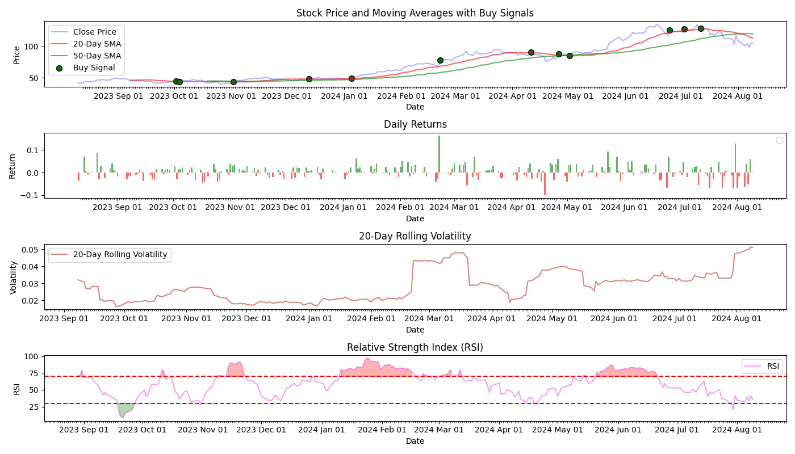

# Stock Analysis

This Python project analyzes stock data using various indicators, such as a simple moving average or the relative strength index.

## Features
- Calculate Simple Moving Averages, SMA (20-day and 50-day)
- Identify buy signals from SMA
- Calculate Relative Strength Index, RSI
- Highlight overbought and oversold conditions from RSI
- Various visualizations (SMA + Close Price, RSI, Rolling Volatility, Daily Returns)

## Planned Features
- Option to download data using `yfinance`

## Installation

Clone the repository and install the dependencies.

```sh
git clone https://github.com/notexploiting/moving-average-analysis
cd moving-average-analysis
pip install -r requirements.txt
```

## Preparing Data

1. Download some financial data to analyze from a source of choice (such as Yahoo Finance). 
2. Move the downloaded file to the same directory as `moving-average-analysis`
3. In `analysis.py`, change the `pd.read_csv` line to read your new datafile.

## Usage

Run the script to calculate indicataors and plot the results.

```sh
python stock_analysis.py
```

## Example

I am using NVDA stock data from Yahoo Finance. 



### Stock Price and Moving Averages with Buy Signals

**Plot Description & Features**:
- **Y-Axis**: Price in the currency in which the stock is traded 
- **Blue Line**: The closing price of the stock
- **Red Line**: 20-day Simple Moving Average, the average closing price over the last 20 days
- **Green Line**: 50-day Simple Moving Average, the average closing price over the last 50 days
- **Green circles**: Buy signals, which indicate some potential points to buy the stock

**Usage**:
- **Compare Moving Averages**: A Moving Average is used to help smooth out price data to identify trends. A rising SMA indicates an uptrend, while a falling SMA indicates a downtrend
- **Buy Signals**: The green circles indicate potential buying opportunities. These are points where the closing price crosses above the 20-day SMA.

### Daily Returns

**Plot Description & Features**:
- **Y-Axis**: Daily Returns in percentage (%) of the previous day's closing price.
- **Green bars**: Positive daily returns (gains)
- **Red bars**: Negative daily returns (losses)

**Usage**:
- **Assess Volatility**: Taller bars indicate higher volatility, the bigger percentage change in the stock price
- **Identify Patterns**: Alternating patterns of positive nad negative returns might indicate cyclical behavior

### 20-Day Rolling Volatility
**Plot Description & Features**:
- **Y-Axis**: 
- **Red Line**: Volatility in Standard Deviation of Daily Returns (%)

**Usage**:
- **Determine Risk**: Higher volatility (wider fluctuations) suggests higher risk

### Relative Strength Index (RSI)
**Plot Description & Features**:
- **Y-Axis**: RSI Value (0-100). 
- **Purple Line**: RSI values
- **Red Line**: Overbought threshold at 70
- **Green Line**: Oversold threshold at 30
- **Red Shaded Areas: RSI values above 70 (overbought)
- **Green Shaded Areas**: RSI vaalues below 30 (oversold)

**Usage**:
- **Identify Conditions**: Values above 70 is considered overbought and the stock might be due for a pullback (entry). Conversely, values below 30 is considered oversold and could see a rebound (exit).
- **Monitor Momentum**: A rising RSI suggests increasing buying pressure, while falling RSI suggests increasing selling pressure.